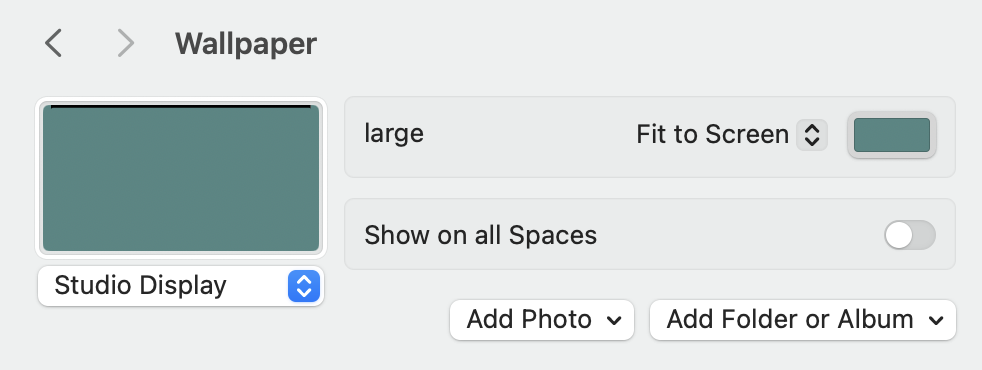
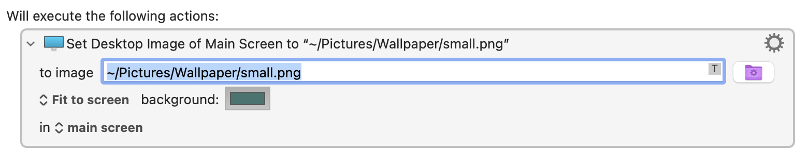

# Help wanted

If you have a Mac with git and Xcode installed and would like to help troubleshoot an API issue I'm having, please download and run this little test app and email me the output.

## To run this app:

First, open Settings (or System Preferences):

- Go to the Wallpaper pane (or Desktop & Screen Saver)
- Set the desktop picture to any image you have handy
- Set the scale mode to "Fit to Screen"
- Choose a fill color by clicking on the color well that appears



Then, open Terminal and run these commands:

```
gh repo clone pascalpp/current-desktop-color
cd current-desktop-color
swift run
```

If the build succeeds, the app will print the current OS version, the current desktop scaling option (a number from 0 to 3), the image clipping setting, and the current fill color. Please email the output to pascalpp+fillcolor@gmail.com.

Keep scrolling if you're curious to know more.

<table height="150"></table>

## The problem I'm trying to solve:

I'm trying to set the desktop image and fill color programmatically in macOS using the `NSWorkspace.shared.setDesktopImageURL` method.

One of the options for that method is `fillColor`, which is supposed to set the color that shows through transparent desktop images. This used to work, but no longer does.

The related method `NSWorkspace.shared.desktopImageOptions` is supposed to return the current desktop image options, including the fill color, but this no longer works either.

I've tested this on Monterey, Ventura, and Sonoma. I've also had a few Sonoma reports come in, all with the same results as I got for Sonoma.

### Monterey

```
macOS version: 12.4.0
imageScaling: Optional(3)
allowClipping: Optional(0)
fillColor: Optional(NSCalibratedRGBColorSpace ...) <-- good
```

### Ventura

```
macOS version: 13.6.0 (Ventura)
imageScaling: Optional(3)
allowClipping: Optional(0)
fillColor: Optional(NSCalibratedRGBColorSpace ...) <-- good
```

### Sonoma

```
macOS version: 14.4.1 (Sonoma)
imageScaling: Optional(3)
allowClipping: Optional(0)
fillColor: nil <-- bad
```

So this looks like a regression in Sonoma.

## Keyboard Maestro

I also tested this in the popular macro utility [Keyboard Maestro](https://www.keyboardmaestro.com), which has a `Set Desktop Image` action that allows you to set the desktop image, scaling method, and fill color, likely using the same `NSWorkspace.shared.setDesktopImageURL` API method. Keyboard Maestro is able to set the fill color in Monterey, but not in Sonoma.



## Why I'm trying to solve this problem

I'd like to make an app that allows the user to assign colors to spaces and easily differentiate one space from another, and to set the background color of the menubar to black or some other color, using transparent desktop images with the fill color showing through. (I've explored other methods of coloring the menu bar but haven't found one that works the way I want.)

So I'm trying to set the desktop image and color programmatically, using the `setDesktopImageURL` method on NSWorkspace.shared.

Some sample code:

```swift
import Foundation
import AppKit

let workspace = NSWorkspace.shared
let screens = NSScreen.screens

let image = NSURL.fileURL(withPath: "/path/to/some/wallpaper.png")

// A nice blue green. This will show through any transparent areas of the image
let color = NSColor(calibratedRed: 64/255, green: 116/255, blue: 112/255, alpha: 1.0)

// NSImageScaling options https://developer.apple.com/documentation/appkit/nsimagescaling
let fit = NSImageScaling.scaleProportionallyUpOrDown.rawValue

let options: [NSWorkspace.DesktopImageOptionKey : Any] = [
  .imageScaling: fit,
  .allowClipping: false,
  .fillColor: color,
]

for screen in screens {
  try workspace.setDesktopImageURL(image, for: screen, options: options)
}
```

This works in Monterey and Ventura, but in Sonoma `setDesktopImageURL` seems to ignore the `fillColor` option, and always sets the fill color to some default blue (even if I have previously set it to some other color manually.)
